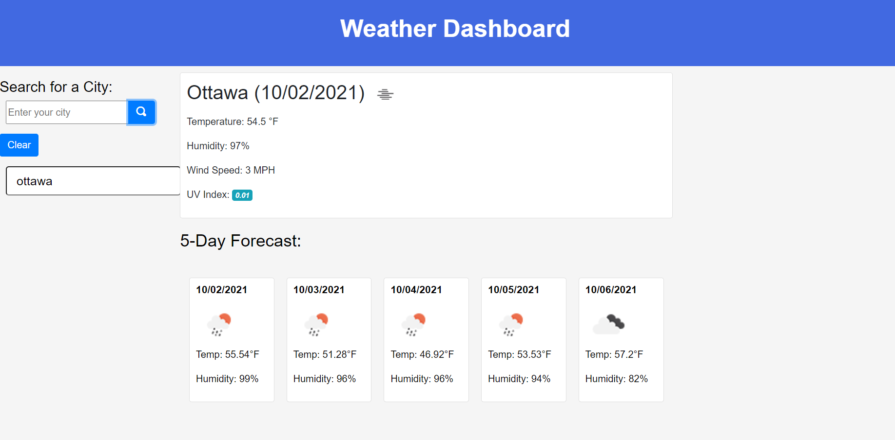

# ass_cha_6
<h1> Server-Side APIs Challenge: Weather Dashboard</h1>
<h2> Task or service given to client</h2>
is used to give weather  statistics of any city in our world,when you give an input of city in<b> a search for the city</b>. 
 
<h3>Mock-Up</h3>
The following image shows the web application's appearance and functionality:
 

 <h2>Coded by:</h2>
Tesfalem H. Tegenge

